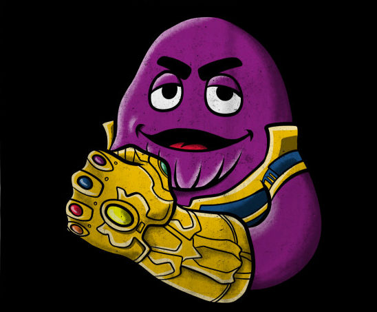
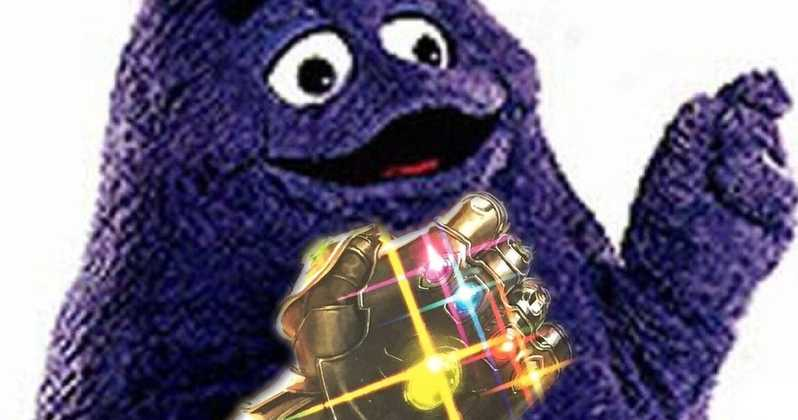

# Thanos or Grimace?
Avengers: Infinity War is one of my favorite movies not only from the superhero genre, but of all time. Besides an insane character crossover, it features quite a few scenes with pop culture references. In one of them, Peter Quill (aka Star-Lord) refers to  Thanos as "Grimace"

For those who don't know, [Grimace is one of McDonaldland's characters](https://mcdonalds.fandom.com/wiki/Grimace). These were quite popular in the 80s and 90s (which fits with Quill's time in Earth as a kid). This reference inspired cosplayers Kittie Cosplay and Banana Steve in making an even crazier crossover: [Grimos](https://twitter.com/kittiecosplay/status/1013298292636053505).

This made me wonder: can we create an algorithm capable of distinguishing between these two purple characters? 

In this project, I created a convolutional-neural-network- (CNN-) based classifier to discriminate images of Thanos and Grimace. I do so under two different approaches: using a pre-trained CNN as a base (i.e., transfer learning) and creating a CNN from scratch. The classifiers reached an accuracy of XXX and XXX%, respectively. I'm sure the models can be improved and analyzed even deeper. Although this is definitely [not the first time that Thanos has received the Machine Learning treatment](https://hackernoon.com/how-machine-learning-developed-the-face-of-mcus-thanos-82f98ef4f381), I still found working with him and Grimace very fun.

**You can [find the notebook of the project here]().**

If you have any comments or suggestions, feel free to [raise an issue here](https://github.com/arturomoncadatorres/thanos-or-grimace/issues) or [drop me a line in Twitter (@amoncadatorres)](https://twitter.com/amoncadatorres).
